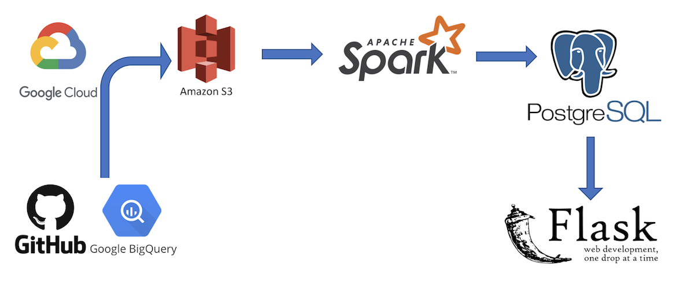

# Function_finder

## 1. Motivation

* Enterprise companies can have large, unwieldy code base

* What functionality is available and reusable?

* Build a system to help identify functions in an existing codebase

* Use GitHub open source python code as data source

## 2. Pipeline

* Obtained GitHub open source python codes from Goolgle BigQuery (~90GB). They were saved to AWS S3 bucket though Google Cloud. 

* Spark-cluster (4 nodes: 1 master and 3 works) was used to read data from AWS S3 and to process the data, i.e., to extract the repository name, class name, function name, function input, and function output, and repo_id from each report. 

* PostgreSQL(AWS RDS) was used to save the final table for querying.

* Flask was used for visualization and user interface. 

## 3. Data Engineer Challenge

* There are duplicated repo_name + function_name reports. 

   * Three cases: different input parameters, different classes, and different repo_ids.

* Add Index in the final PostgreSQL table for fast query though user interface. 

## 4. Source code

* Test: csv and json read tests, textfile .vs. sqlContext

* Duplication_check: test code to check the duplicated repo_name + function_name cases.

* Flask: the visualization and user interface setup.

* Spark: the main python script for pipeline to processing all the input data.

* QandA: Demo questions and answers
